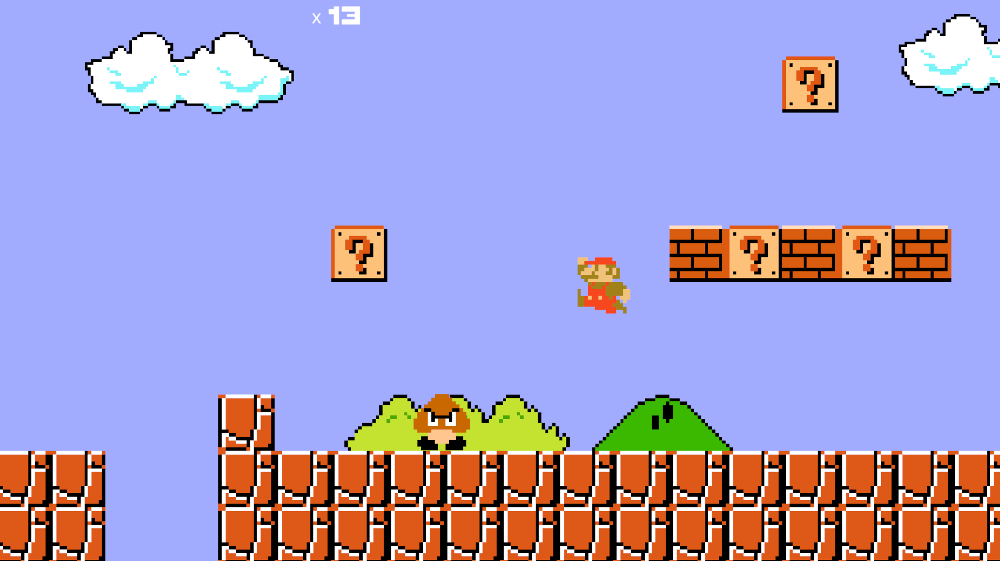
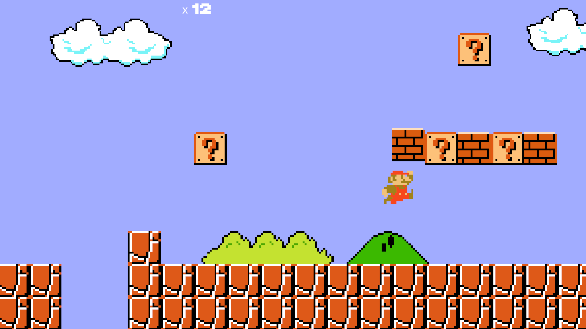

# 🎮 Super Mario Bros – Remake em Unity

Este projeto é um **remake do clássico Super Mario Bros**, desenvolvido em **Unity com C#**, com foco em aprendizado, prática de game design 2D e fundamentos de programação para jogos.

O objetivo principal foi recriar mecânicas clássicas do jogo original, como movimentação do personagem, colisões com blocos, coleta de itens, sistema de pontuação e interações com o cenário, respeitando o estilo retrô em pixel art.

---

## 🚀 Funcionalidades
- Movimentação lateral e pulo do personagem
- Sistema de colisão com blocos (tijolos e blocos surpresa)
- Sistema de pontuação
- Sprites em **pixel art**
- Cenário inspirado no mundo clássico do Super Mario Bros
- Desenvolvimento em resolução baixa para manter o estilo retrô

---

## 🛠️ Tecnologias Utilizadas
- **Unity (2D)**
- **C#**
- **Pixel Art**
- **Git & GitHub** para versionamento

---

## 📚 Objetivo do Projeto
Este projeto foi desenvolvido com fins **educacionais**, com o objetivo de:
- Aprender Unity 2D na prática  
- Trabalhar com física, colisões e animações  
- Entender melhor a organização de projetos de jogos  
- Praticar versionamento de código com Git  

---

## ⚠️ Aviso Legal
Este projeto **não possui fins comerciais**.  
Todos os direitos da franquia **Super Mario Bros** pertencem à **Nintendo**.  
O jogo foi recriado apenas para fins de estudo e aprendizado.

---

## 👨‍💻 Desenvolvedor
Projeto desenvolvido por **Caique Macedo** 🎮  
